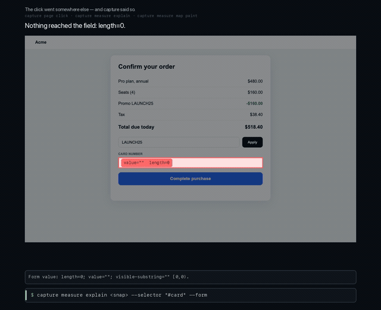
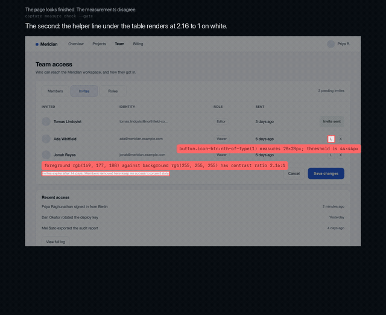
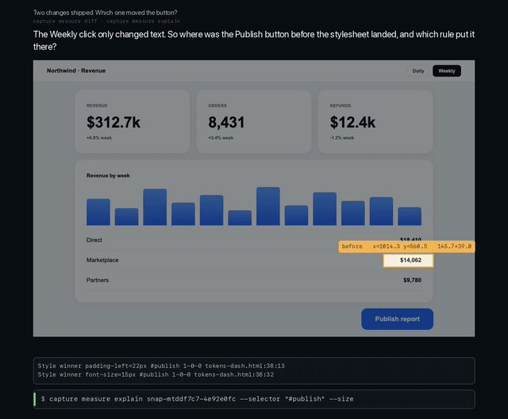
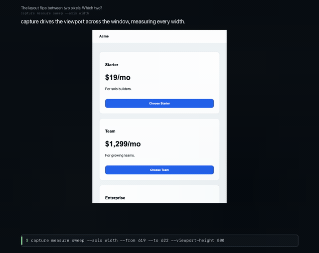
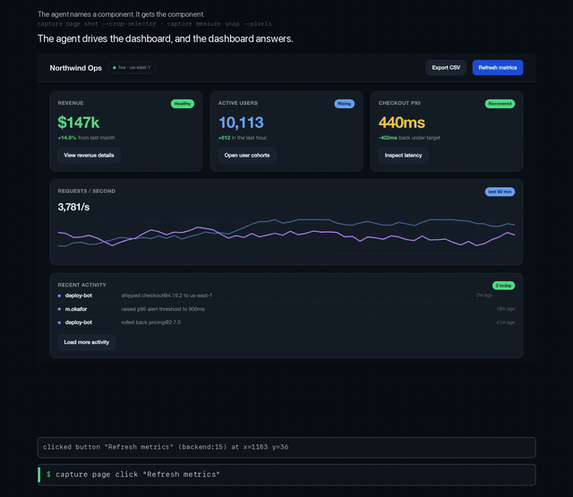
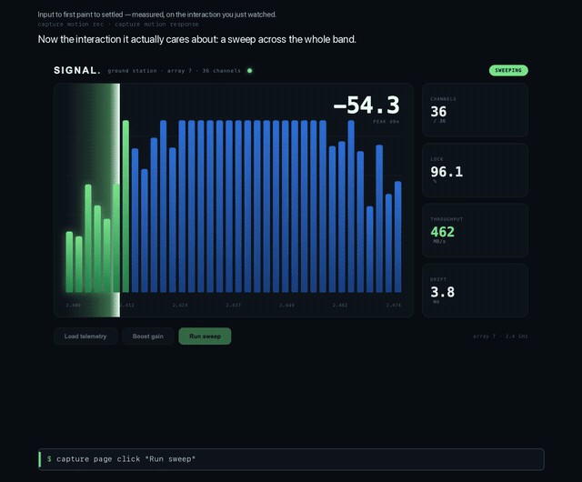
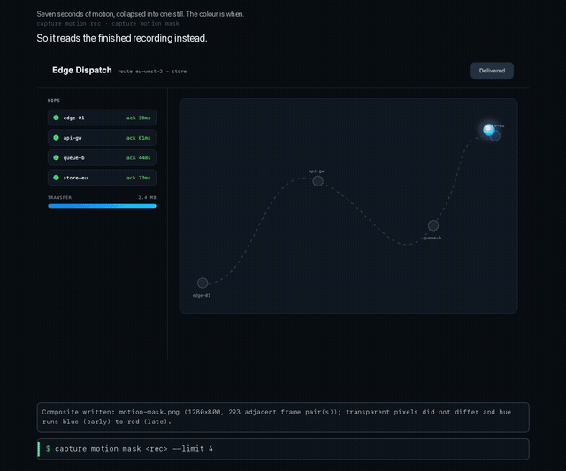
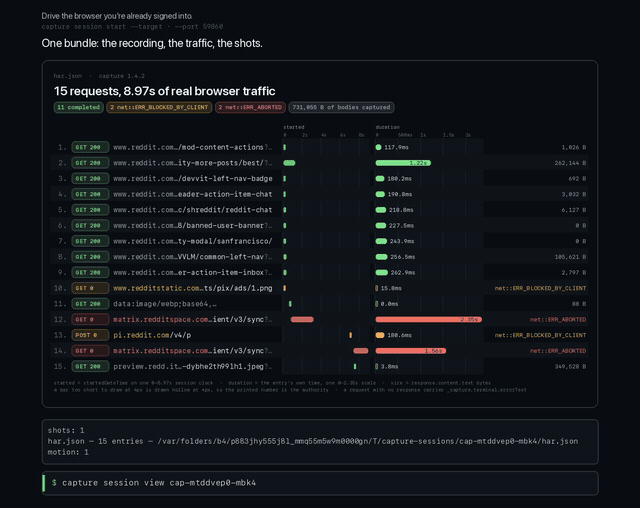

# capture

**Browser automation that measures instead of guessing.** A CDP command line built for agents.

A screenshot shows you what a page looks like. It does not show you why the button doesn't work.

`capture` answers questions about a live page with numbers and coordinates: what is covering this button, which CSS rule moved it, how long the page took to answer a click, what changed between two states, and which pixels moved and when. Every finding comes back with the element, the geometry, and the evidence it was read from.

```bash
npm install -g @crouton-kit/capture
```

Needs Node and a Chrome. `capture tab launch` starts a headless browser that capture owns and reaps — it looks for `$CAPTURE_BROWSER`, then a `~/.cache/puppeteer` Chrome, then a system Chrome. If a CDP-enabled browser is already running, capture can attach to that instead.

## Quick start

```bash
capture tab launch                                    # start a browser capture owns
capture session start --url https://example.com       # open a tab, begin recording traffic
capture measure snap                                  # → snap-mtdpfnkr-08fbabdd
capture measure check snap-mtdpfnkr-08fbabdd --for contrast,tap-targets
capture session stop <session-id>                     # write the bundle manifest
```

`measure check` reports real measurements, not opinions:

```
1. tap-targets — html > body > div > p:nth-of-type(2) > a measures 82×18px; threshold is 44×44px
   Rect: x=160 y=186.078125 w=82 h=18
   crop: snap-mtdpfnkr-08fbabdd/findings/1-tap-targets.png
```

Add `--gate` to `check` or `diff` and it exits nonzero on findings, so the same command works in CI.

## See it

Eight short clips. Every overlay is real: the text is extracted from the command's actual stdout, the boxes are drawn at the coordinates the command printed, and the inset images are files a command actually wrote.

Each preview below is a few seconds of the clip. Click through for the full version.

### 1. Every command succeeded. The page is still broken.



An agent checks out. The promo code applies and the total drops $691.20 → $518.40, so the page is clearly working. Then it clicks **Complete purchase** — reported clicked, nothing happens. Rather than guess, it measures. The hit test resolves the click to something that is not the button, and `measure map paint` names it: `#consent`, z-index 99, **covering 100.00%** of the button's ink box.

Playwright throws "element intercepts pointer events" and names nothing. A screenshot shows a perfect page.

`capture measure map paint <snap> --selector "#pay"` · [full clip, 22s](demo/1-ghost-overlay.mp4)

### 2. The page looks finished. The measurements disagree.



One command measures a team-access page against thresholds and draws every failure onto it at real coordinates: a row control at 28×28 under the 44×44 floor, a helper line at 2.16:1 contrast, an identity column clipping the address it is showing you. Each finding carries a cropped PNG of its own evidence, and the gate exits nonzero.

`capture measure check <snap> --for tap-targets,contrast,truncation --gate` · [full clip, 22s](demo/2-check-gate.mp4)

### 3. Two changes shipped. Which one moved the button?



A report switches to Weekly, then a design-system stylesheet lands live. The Publish button is somewhere new. A pixel diff can only say "3% of pixels differ" — this names the element, both of its boxes, how far it moved, and the declaration that now wins, down to `tokens-v2.css` line 6.

`capture measure diff --before <snap> --after <snap>` · [full clip, 27s](demo/3-measure-diff.mp4)

### 4. The layout flips between two pixel widths. Which two?



Instead of dragging a window edge until something snaps, sweep the axis. The viewport steps 619 → 620 → 621 → 622, the grid goes one column to two, and the command brackets the exact pair it happened between.

`capture measure sweep --axis width --from 619 --to 622` · [full clip, 21s](demo/4-sweep-breakpoint.mp4)

### 5. Name a component. Get the component.



The agent asks for a card and gets a cropped, padded, zoomed image of exactly that card — no coordinates, no full-viewport screenshot to squint at. It can ask by CSS selector or by the visible label a screen reader would read. Ask for `button` when six match, and it refuses to guess and lists all six.

`capture page shot --crop-selector "#revenue-card" --pad 8 --zoom 1.5` · [full clip, 24s](demo/5-component-shot.mp4)

### 6. How fast did that click actually answer?



Record a real interaction, then read its timeline off the recording rather than eyeballing a screenshot: input dispatch, DOM mutation at +7.20ms, first paint at +18.76ms across 6276 changed pixels, settled at +325.06ms. Every row names the evidence it came from.

`capture motion response <rec> --action "click:Run sweep"` · [full clip, 23s](demo/6-motion-response.mp4)

### 7. Seven seconds of motion, in one still.



A whole animated interaction collapsed into a single image where colour encodes *when* each pixel changed — blue is early, red is late, and the entire route of the payload is one picture. Underneath it, the changed regions ranked largest first with the window each one moved in.

`capture motion mask <rec> --limit 4` · [full clip, 22s](demo/7-motion-mask.mp4)

### 8. Drive the browser you are already signed into.



No storage-state dance and no separate automation profile. Attach over `--port`, adopt the tab already in front of you, drive it, and finish with one bundle: the recording, the HAR, the shots and the measurements together. The network panel is drawn from the captured HAR — every field read from that entry, nothing inferred, and credential headers withheld with their length marked in place.

`capture session start --target <tab-id> --port 9860` · [full clip, 30s](demo/8-live-session.mp4)

## The command surface

Seven roots. Every leaf renders prose by default and mirrors the same result under `--json`.

| root | what it owns |
|---|---|
| `session` | the artifact container — records HAR, bundles artifacts, sets the active context |
| `page` | verbs against the live tab — `click`, `type`, `scroll`, `navigate`, `exec`, `shot`, `elements` |
| `tab` | browser and tab plumbing — `launch`, `list`, `open`, `close`, `reset`, `network` |
| `measure` | settled-snapshot substrate plus read-only queries — `snap`, `check`, `diff`, `explain`, `sweep`, `census`, `map` |
| `motion` | recorder lifecycle plus queries over a recording — `rec`, `mask`, `timeline`, `response`, `jank` |
| `cdp` | raw Chrome DevTools Protocol escape hatch |
| `lib` | vault-lib introspection, for running forked libs in the tab |

Run any of them bare for the subcommand list, or `capture <root> <leaf> -h` for a leaf's usage.

## How it fits together

Three artifact kinds, and the split matters because it is what keeps queries cheap.

- **A session** is the container. It opens or adopts a tab, records HAR while it is active, and writes a bundle manifest when it stops. Everything produced while it runs lands in one directory.
- **A snapshot** (`measure snap`) drives the page once and writes a settled substrate — geometry, styles, accessibility, layers, hit testing, text, forms, screenshot. Every other `measure` leaf is a cheap read over that artifact and never re-drives the browser.
- **A recording** (`motion rec`) captures an interaction, one-shot or composed across several commands. Every other `motion` leaf reads the finalized recording.

Findings exit 0 — they are a report, not a crash. Only `check` and `diff` accept `--gate`, which turns findings into exit 2.

## Targeting elements

The driving verbs resolve exactly one element through a single grammar, and reject an ambiguous target with the list of candidates rather than picking one:

- a bare CSS selector (takes precedence)
- an exact accessible name, when CSS finds nothing
- `ax:<name>`, `axid:<id>`, or `backend:<id>`

## For agents

The CLI is designed to be read by a model: errors are structured, every error carries a `follow_up` naming the command that would fix it, and help is available at every level.

## License

MIT
